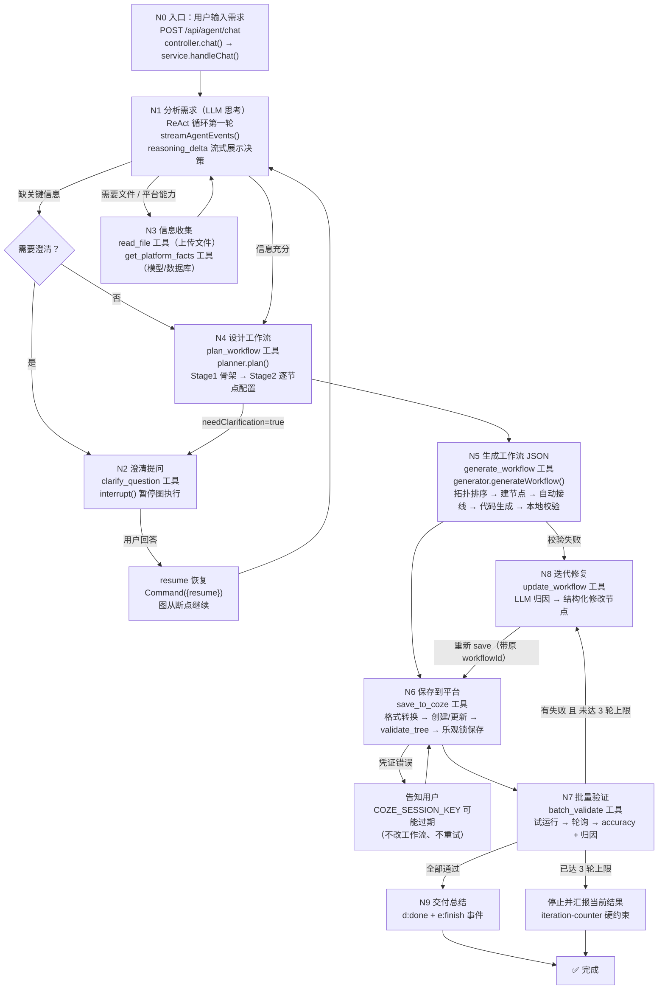

# LLM ReAct 思考链路全景图（含代码映射）

> 配套《Coze 工作流 Agent 项目 · 深度阅读手册》使用。本文把「一次需求从进来到最后交付」的完整思考链路画出来，每个节点标注对应代码文件与方法名，包含澄清、失败、迭代、凭证、打断等所有分支。
> 项目：ai-tools-demo/src/agent-coze-workflow（2026-08-15 快照）

---

## 一、链路总览

---

## 二、主链路节点详解

### N0 入口：拿到需求

| 项 | 内容 |
|---|---|
| 触发 | 前端 useChat 发送 → `POST /api/agent/chat` body { sessionId?, message } |
| 代码 | `apps/api/src/agent/react-agent.controller.ts` → `chat()` |
| 内部 | `ReactAgentService.handleChat()`（react-agent.service.ts） |
| 关键步骤 | ① sessionStore 获取/创建会话（新会话 = 新 graph + 新 MemorySaver）② 检查 graphDirty（上次被打断则重建 graph）③ messages 转 LangChain BaseMessage 数组 ④ setSSEHeaders + 发 `d:{type:"session"}` ⑤ `streamAgentEvents()` 开始迭代 |
| 分支 | 参数校验失败 → 直接 `d:error`；会话首次 → 自动生成 sessionId 返回前端 |

### N1 分析需求（LLM 第一轮思考）

| 项 | 内容 |
|---|---|
| 代码 | `ReactAgentService.createGraph()` → `createReactAgent({ llm, tools: ALL_TOOLS, checkpointer: MemorySaver, prompt: SYSTEM_PROMPT, recursionLimit: 40 })` |
| 内部 | `streamAgentEvents()` 迭代 `on_chat_model_stream` 事件：DeepSeek 思考内容（reasoning_content）→ `d:reasoning_delta`（前端思考气泡）；正文 → `0:"text"` |
| LLM 决策依据 | SYSTEM_PROMPT 里的 10 个工具说明 + 使用规则（缺信息先问、规划→生成→部署→验证顺序、save 规则、凭证错误处理、迭代上限） |
| 分支 | 需求信息不完整 → N2；需求涉及文件/平台能力 → N3；信息充分 → N4 |

### N2 澄清提问（interrupt / resume 闭环）

| 项 | 内容 |
|---|---|
| 触发 | LLM 判断缺数据源/格式约定/输出要求/验收标准 |
| 代码 | `apps/api/src/agent/tools/clarify.tool.ts` → `clarifyQuestionTool` → 工具内调 `interrupt({ question, context })` |
| 暂停 | 图执行暂停 → `streamAgentEvents` 流结束 → `extractInterruptData()` 从 `state.tasks[].interrupts[].value` 读问题 → 发 `d:{type:"interrupt"}` |
| 前端 | 渲染提问卡片 + 输入框切回复模式 → 用户回答 → `handleAnswer()` 手写 fetch 调 `POST /api/agent/chat/resume` |
| 恢复 | `ReactAgentController.resume()` → `ReactAgentService.handleResume()` → `new Command({ resume: answer })` → 图从断点继续 → clarify 工具返回 `"用户回答: xxx"` → LLM 继续分析 |
| 分支 | resume 时会话不存在 → `d:error "会话不存在或已过期"`；resume 可带 fileIds（文件引用拼入回答文本） |

### N3 信息收集（文件 + 平台事实）

| 项 | 内容 |
|---|---|
| 文件上传 | `ReactAgentController.upload()`（multipart → apps/api/uploads/ → 返回 fileId）→ resume 时按 fileId 还原路径 |
| 文件读取 | `apps/api/src/agent/tools/read-file.tool.ts` → `readFileTool`：xlsx/xls/csv → { columns, rows }；md/txt/json → { content }；零业务假设，用途由 LLM 判断 |
| 平台事实 | `apps/api/src/agent/tools/platform-facts.tool.ts` → `getPlatformFactsTool` → `CozeClient.listModels()`（25 模型 + audio/image/video 能力标记）+ `listDatabases()`（res_id）+ 静态 44 节点类型 |
| 失败分支 | 文件不存在 → `"读取失败: 文件不存在"`；模型/数据库接口挂了 → 对应字段空数组 + `_warning_*` 提示（不阻塞） |

### N4 设计工作流（plan_workflow）

| 项 | 内容 |
|---|---|
| 代码 | `apps/api/src/agent/tools/plan.tool.ts` → `planWorkflowTool` → `workflow-engine/planner.ts` → `WorkflowPlanner.plan()` |
| Stage 1 骨架 | `DeepSeekClient.chatStructured(PlanSkeletonSchema, PLAN_SKELETON_PROMPT, 需求)` → 输出轻量骨架（元信息 + steps 内嵌 contracts，1-2K token） |
| 澄清分支 | 骨架 `needClarification=true` → 返回带 `_clarification` 的 plan → Agent 收到后调 clarify_question（回到 N2） |
| Stage 2 配置 | `refineConfigs()` 逐节点并行生成 nodeConfig（并发 3 防 429）→ 每个节点一次调用（约 200 token）→ `refineOneConfig()` 失败降级 `{}` |
| 合并映射 | `mapToWorkflowPlan()`：name sanitize（字母开头+≤50）、steps 组装（LLM 显式 steps 顺序权威，无则布尔标志兜底）、start 排第一 end 排最后、contracts 与 steps 按 index 一一对应 |
| 失败分支 | LLM 调用失败 → 工具返回 `"规划失败: ..."`（不抛异常，LLM 决定下一步）；单节点 config 失败不影响整体 |
| 输出 | WorkflowPlan JSON（name/description/steps/modules/estimatedComplexity）→ 前端工具面板 + 草图渲染 |

### N5 生成工作流 JSON（generate_workflow）

| 项 | 内容 |
|---|---|
| 代码 | `apps/api/src/agent/tools/generate.tool.ts` → `generateWorkflowTool` → `workflow-engine/generator.ts` → `WorkflowGenerator.generateWorkflow(plan, referenceData)` |
| 步骤 1 | `topoSortSteps()` 拓扑排序（LLM 的 order 可能错，代码保证 start→...→end） |
| 步骤 2 | 第 1 遍 `createNodeForStep()` 建节点骨架（调 packages/workflow-schema 工厂 createXxxNode） |
| 步骤 3 | 按 dependencies 生成 edges |
| 步骤 4 | `buildInputMapping()` 自动接线（start 多输入全映射；其他节点输出 → input 参数；不靠 LLM） |
| 步骤 5 | 第 2 遍 code 节点 → `workflow-engine/code-generator.ts` → `CodeGenerator.generateCode()`（LLM 生成平台规范 Python 代码，referenceData 强制内嵌为常量防幻觉）→ 失败降级 `buildFallbackCode()`（可运行 echo 模板） |
| 步骤 6 | `createLLMEdges()` 补 default + branch_error 双出边（平台约定） |
| 步骤 7 | `createConditionEdges()` 条件节点分支边（true / true_1 / ... / false → end） |
| 本地校验 | `packages/workflow-schema/src/validator` → `validateWorkflow()` 结构校验 |
| 失败分支 | 生成异常 → `"生成失败: ..."`；结构校验不过 → 返回 { workflow, validation:{valid:false, errors} }（工作流仍返回，LLM 决定修复或重生成） |

### N6 保存到平台（save_to_coze）

| 项 | 内容 |
|---|---|
| 代码 | `apps/api/src/agent/tools/save.tool.ts` → `saveToCozeTool` |
| 步骤 1 | `validateWorkflow()` 结构校验（不过 → 返回错误让 LLM 修） |
| 步骤 2 | `workflow-engine/platform-validator.ts` → `checkPlatformCompatibility()`（start/end 唯一、code/llm 必须有 outputs、模型在平台列表、condition 无 TODO、database connection 非空） |
| 步骤 3 | `CozeClient.listModels()` → 模型名→modelType 映射（失败不阻塞，默认 201） |
| 步骤 4 | `apps/api/src/coze/schema-converter.ts` → `convertToPlatformSchema()`（项目格式 → 平台格式：类型数字映射、start→100001、ref 引用、llmParam 14 项） |
| 步骤 5 | 创建/更新：首次不传 workflowId → `createWorkflowWithRetry()`（名称冲突自动 _2/_3/_4）；迭代修复传原 workflowId → 直接更新不新建 |
| 步骤 6 | `CozeClient.validateTree()` 平台连通性校验 → 有错：首次创建 `deleteWorkflow()` 清空壳；更新保留原工作流 → 返回错误让 LLM 修连线 |
| 步骤 7 | `CozeClient.saveWorkflow()`（乐观锁：ensureLock → getSchema 拿最新 submit_commit_id → save → 777777759/777777770 自动重试 3 次，重试前清锁等 2s） |
| 步骤 8 | `resetIteration(workflowId)` 重置迭代计数 |
| 失败分支 | 凭证错误（authentication failed / access denied）→ 系统提示词强制：不改工作流、不反复保存，直接告知用户"COZE_SESSION_KEY 可能过期，请检查 .env" |
| 输出 | `{ workflowId, saved:true, name, updated }` |

### N7 验证（test_run_workflow + batch_validate）

| 项 | 内容 |
|---|---|
| 单次试运行 | `apps/api/src/agent/tools/test-run.tool.ts` → `testRunWorkflowTool` → `CozeClient.testRun()` → executeId |
| 批量验证 | `apps/api/src/agent/tools/batch-validate.tool.ts` → `batchValidateTool` |
| 迭代计数 | `tools/iteration-counter.ts` → `incrementIteration()`（超 MAX_ITERATIONS=3 → 返回"已达迭代上限"错误，LLM 必须停止） |
| 执行 | 串行遍历 cases（防限流）：`CozeClient.testRun()` → `getProcess()` 轮询（5s 间隔 / 5min 超时） |
| 结果判定 | executeStatus=2 完成 → 从 end 节点 output 提取实际值比对；executeStatus=3 失败 → 收集失败节点 errorInfo |
| 归因分组 | failurePatterns：emptyOutput（输出为空）/ mismatch（期望≠实际）/ executionError（执行错误/超时） |
| 输出 | `{ total, passed, failed, accuracy, details[], failurePatterns }` |
| 分支 | 全部通过 → N9；有失败且未达上限 → N8；达上限 → 停止并汇报当前结果 |

### N8 迭代修复（update_workflow）

| 项 | 内容 |
|---|---|
| 触发 | LLM 分析 failurePatterns 归因 → 生成自然语言 fixInstruction |
| 代码 | `apps/api/src/agent/tools/update-workflow.tool.ts` → `updateWorkflowTool` |
| 步骤 1 | `incrementIteration()`（超限拒绝） |
| 步骤 2 | `parseInstruction()` → `DeepSeekClient.chatStructured(UpdateInstructionSchema)` 把自然语言解析为 { type, target, content } |
| 步骤 3 | `findTargetNode()` 定位节点（title 精确 → id → title 包含） |
| 步骤 4 | 按 type 执行：llm_prompt（system/user 关键词判断）/ code_logic（需 referenceData 防幻觉 + 明确重写关键词）/ condition / threshold（正则 `旧值 改为/→ 新值`）/ data（JSON 解析优先） |
| 失败分支 | 解析失败 → PARSE_FAIL_MESSAGE；type=other → 无法归类；找不到节点；类型不匹配；code_logic 无 referenceData → 拒绝重写；threshold 格式错/值不存在 → 错误提示 |
| 闭环 | 返回 { workflow, changes } → LLM 重新 `save_to_coze`（**必须带原 workflowId**）→ 重新 `batch_validate` → 回到 N7 判定 |

### N9 交付总结

| 项 | 内容 |
|---|---|
| 触发 | 验证通过 / 达迭代上限 / 用户需求完成 |
| 代码 | `ReactAgentService.extractFinalContent()` 从 state 取最后一条 ai 消息 |
| 输出 | `d:{type:"done", final}` + `e:{type:"finish"}` → 前端渲染完成 |
| 内容 | LLM 总结整个流程：workflowId + accuracy + 失败分析 + 建议 |

---

## 三、全局分支（任意节点可触发）

| 编号 | 场景 | 处理 | 代码位置 |
|---|---|---|---|
| G1 | recursionLimit 超限（ReAct 循环过深/陷入死循环） | 识别错误消息 → `d:error "Agent 执行步骤过多（可能陷入循环），已停止"` | react-agent.service.ts streamAgentEvents catch |
| G2 | 客户端断开（用户打断/关页面） | res close 事件 → `session.graphDirty = true`（不等 for await 检测，事件循环立即触发）；`stream.cancel()` 终止后台执行防未捕获异常崩溃；下次 chat 重建 graph 清脏 checkpoint，对话记忆由 session.messages 保留 | react-agent.service.ts onClose + handleChat 1.5 |
| G3 | 流异常（LLM 超时/网络错误/工具抛错） | catch → `d:error` + end | streamAgentEvents catch |
| G4 | LLM 工具参数解析失败 | 错误反馈给 LLM 重试（缓解手段：maxTokens 8192 + thinking disabled + maxRetries 1） | react-agent.service.ts llm 实例配置 |
| G5 | 工具调用失败（规划/生成/保存/验证等） | 不抛异常，返回 `"xxx失败: 原因"` 字符串 → LLM 看到后自行决策（重试/改方案/告知用户） | 各 tool 的 try/catch |

---

## 四、SSE 事件 ↔ 前端渲染对照

| SSE 事件 | 触发点 | 前端表现 | 前端代码 |
|---|---|---|---|
| `d:{type:"session"}` | 会话创建 | 记录 sessionId，后续请求携带 | App.tsx handleDataEvent session |
| `d:{type:"reasoning_delta"}` | LLM 思考增量 | 思考气泡流式展示（data.type="reasoning"） | App.tsx reasoning_delta 分支 |
| `0:"文本"` | LLM 正文增量 | 消息气泡流式追加（分段管理） | data-stream.ts + App.tsx text_delta |
| `d:{type:"tool_start"}` | 工具开始 | 工具链面板新增 running 项（UUID key） | App.tsx tool_start |
| `d:{type:"tool_end"}` | 工具结束 | 面板标记 done/error（isToolOutputFailed 判断）；generate 输出 → JSON 面板；plan 输出 → 草图 | App.tsx tool_end |
| `d:{type:"interrupt"}` | clarify 暂停 | 提问卡片（固化消息流）+ 回复模式 | App.tsx interrupt |
| `d:{type:"done"}` | 链路完成 | 封存分段 | App.tsx done |
| `d:{type:"error"}` | 任意失败 | 顶部错误条 | App.tsx error |
| `e:{type:"finish"}` | 流结束标记 | 流自然收尾（转换层丢弃） | data-stream.ts |

---

## 五、附：代码方法速查表

| 链路节点 | 文件 | 方法/函数 |
|---|---|---|
| N0 | agent/react-agent.controller.ts | chat() / resume() / upload() |
| N0-N9 | agent/react-agent.service.ts | handleChat() / handleResume() / streamAgentEvents() / extractInterruptData() / extractFinalContent() / extractToolContent() / createGraph() |
| N2 | agent/tools/clarify.tool.ts | clarifyQuestionTool（内部 interrupt()） |
| N3 | agent/tools/read-file.tool.ts | readFileTool（parseTable / parseText） |
| N3 | agent/tools/platform-facts.tool.ts | getPlatformFactsTool |
| N4 | agent/tools/plan.tool.ts → workflow-engine/planner.ts | planWorkflowTool → WorkflowPlanner.plan() / refineConfigs() / refineOneConfig() / mapToWorkflowPlan() / sanitizeWorkflowName() |
| N4 | llm/deepseek.client.ts | DeepSeekClient.chatStructured() |
| N5 | agent/tools/generate.tool.ts → workflow-engine/generator.ts | generateWorkflowTool → WorkflowGenerator.generateWorkflow() / buildWorkflow() / buildSketch() / createNodeForStep() / buildInputMapping() / topoSortSteps() / createLLMEdges() / createConditionEdges() |
| N5 | workflow-engine/code-generator.ts | CodeGenerator.generateCode() / buildFallbackCode() |
| N5 | packages/workflow-schema/src/validator | validateWorkflow() |
| N6 | agent/tools/save.tool.ts | saveToCozeTool / createWorkflowWithRetry() / sanitizeWorkflowName() |
| N6 | workflow-engine/platform-validator.ts | checkPlatformCompatibility() |
| N6 | coze/schema-converter.ts | convertToPlatformSchema() |
| N6 | coze/coze.client.ts | createWorkflow() / acquireEditLock() / ensureLock() / getSchema() / validateTree() / saveWorkflow() / deleteWorkflow() / updateMeta() / listModels() / listDatabases() / testRun() / getProcess() |
| N7 | agent/tools/test-run.tool.ts | testRunWorkflowTool |
| N7 | agent/tools/batch-validate.tool.ts | batchValidateTool（extractOutputString / sleep） |
| N7/N8 | agent/tools/iteration-counter.ts | incrementIteration() / resetIteration() / iterationLimitMessage() |
| N8 | agent/tools/update-workflow.tool.ts | updateWorkflowTool / parseInstruction() / findTargetNode() / replaceThresholdText() / summarizeNodes() |
| N9 | agent/tools/rename-workflow.tool.ts | renameWorkflowTool（改名分支，不走 save） |
| 会话 | agent/session.store.ts | SessionStore.create() / get() / delete() |
| 上传 | agent/upload-store.ts | uploadPathStore（fileId → { path, name }） |
| 工具注册 | agent/tools/index.ts | ALL_TOOLS / withToolLog() |
| 旧链路参考 | legacy/graph.ts | createWorkflowGraph()（plan→sketch→generate→validate→repair 固定流水线） |

---

## 六、相关设计讨论记录（2026-08-15）

- 本链路中 N4（planner）当前让 LLM 输出骨架 JSON（steps + contracts 内嵌），复杂工作流时 JSON 嵌套深、dependencies 数组下标引用脆弱。
- 已讨论方向：改为**行式 DSL**（WORKFLOW / INPUT / NODE / EDGE 指令，节点 id 引用，行级容错），LLM 只输出节点类型 + 输入输出 + 连接关系。
- 状态：设计讨论已记录（memory/2026-08-15.md），**未落地**；下一步建议先用 codex 实测两种格式的 LLM 输出正确率再定方案。
- 注意：DSL 落地只替换 planner 输出格式 + 新增 parser，本链路 N5 之后全部节点不受影响。
